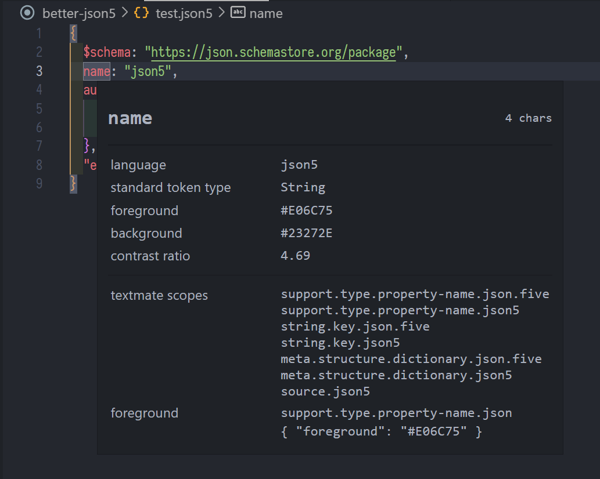
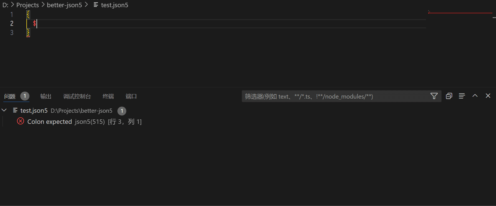
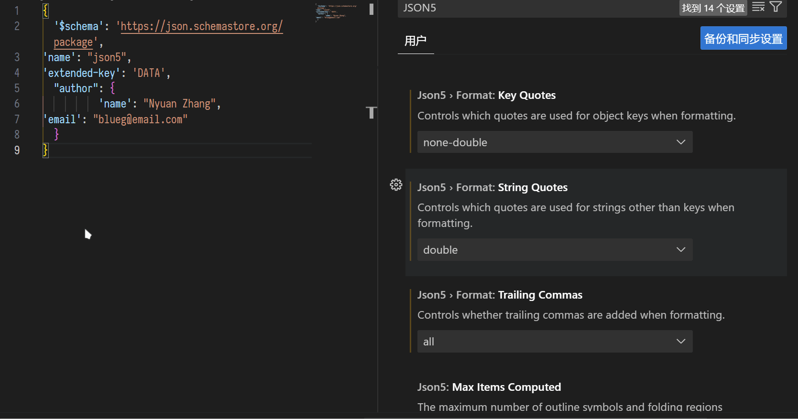
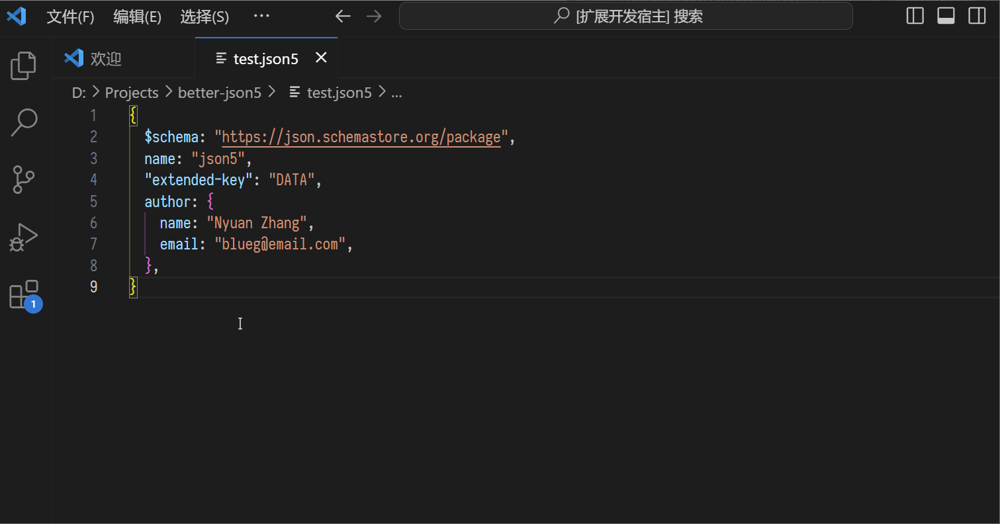
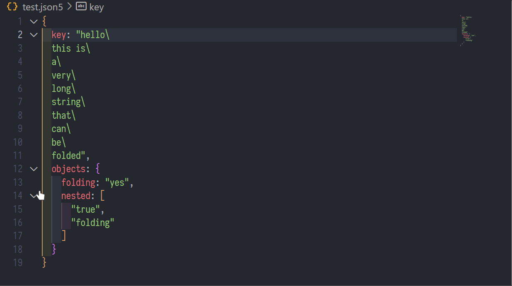

# better-json5 

> JSON5 support for Visual Studio Code, done right ⚡

## Features

#### Syntax highlighting with correctly colored keys, with your favorite theme support out-of-the-box

#### JSON Schema based validation and intellisense

#### Completely configurable formatting

#### Sorting Command

#### Proper folding for objects, arrays and multiline strings

## Extension Settings

- `json5.schemas`: Associate schemas to JSON5 files in the current project.
- `json5.validate.enable`: Enable/disable validation.
- `json5.format.enable`: Enable/disable formatting.
- `json5.format.keepLines`: Keep all existing new lines when formatting.
- `json5.format.trailingCommas`: Control the occurrence of trailing commas in objects and arrays.
- `json5.format.keyQuotes`: Control the usage of quotes for object keys.
- `json5.format.stringQuotes`: Control the usage of quotes for string values in objects and arrays.
- `json5.tracing`: Traces the communication between VS Code and the JSON5 language server.

## Credits

This extension is heavily based on the [JSON Language Features](https://github.com/microsoft/vscode/tree/main/extensions/json-language-features) extension by Microsoft.

## Changelog

See [CHANGELOG.md](CHANGELOG.md)

## License

[MIT](LICENSE.md)